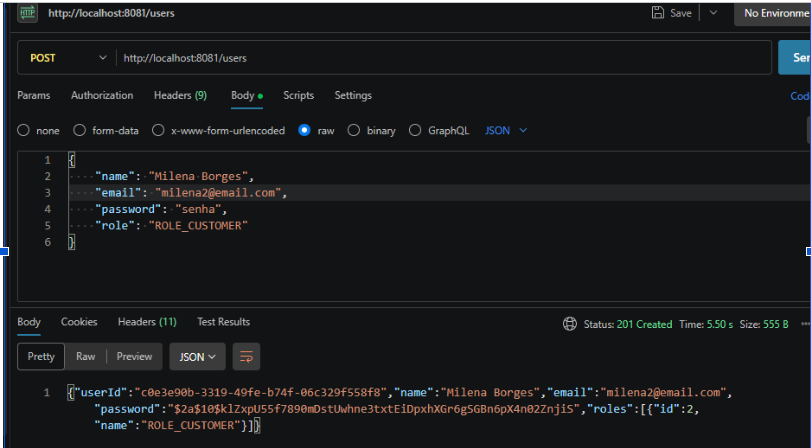
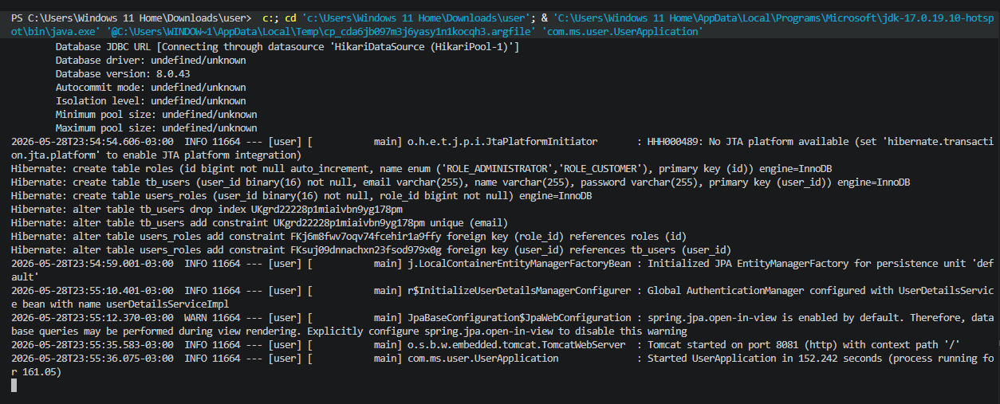
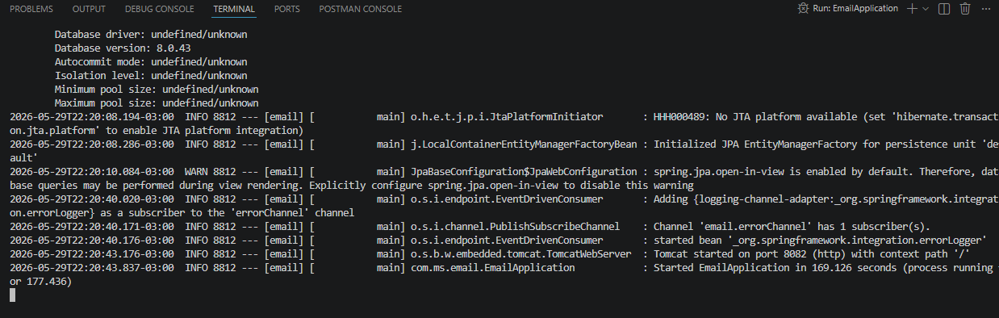

# User Service - Etapa 1

Microsserviço de usuários rodando na porta 8081, conectado ao banco MySQL e com regras do Spring Security ativadas.

## Evidências de Funcionamento

**1. Criação de Usuário (Status 201 Created)**

**2. Servidor Iniciado (Porta 8081 e Banco de Dados)**

# EMAIL Service (Porta 8082)
**2. Servidor Iniciado (Porta 8082 e Banco de Dados)**

